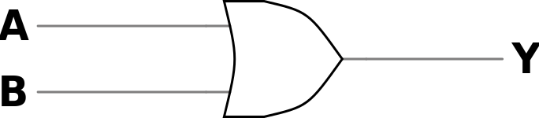
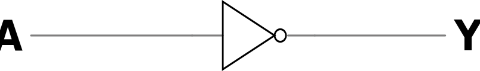

# Lógica Booleana

### Prof. João Paulo Cerquinho Cajueiro
#### Baseado em slides de Prof. José Rodrigues de Oliveira Neto

Universidade Federal de Pernambuco  
Departamento de Engenharia Mecânica

---

# Álgebra Booleana

---

# Introdução

- Desenvolvida por George Boole (1815-1864) em seu livro ***"An Investigation of the Laws of Thought on Which are Founded the Mathematical Theories of Logic and Probabilities"*** de 1854

- Claude Shannon (1916-2001) juntou a lógica booleana aos circuitos chaveados com relés em sua dissertação de mestrado ***"A Symbolic Analysis of Relay and Switching Circuits"*** de 1938

---

<!-- # Aplicações da Álgebra Booleana

- Sistemas digitais podem ser **analisados** utilizando-se a lógica booleana

- O **projeto** de sistemas digitais também pode ser feito com o uso da lógica booleana

- **Circunstâncias** - Entradas do Sistema

- **Decisões** - Saídas do Sistema

--- -->

# Constantes e Variáveis Booleanas

Dois estados possíveis: 0 ou 1 também chamados de **níveis lógicos**

| **Nível Lógico 0** | **Nível Lógico 1** |
|-------------------|-------------------|
| Falso             | Verdadeiro        |
| Desligado         | Ligado            |
| Baixo             | Alto              |
| Não               | Sim               |
| Aberto            | Fechado           |

---

# Notação de Variáveis

<v-clicks>

- Usualmente, utilizamos letras maiúsculas para representar variáveis booleanas

- **Exemplos:**
  - $A = 1$
  - $B = 0$  
  - $C = 0$

</v-clicks>

---

# Operações Lógicas

As operações básicas na álgebra booleana são:

- **`OR` - 'OU' lógico**, que também usualmente recebe o sinal '+'
  - $A \~{\texttt{OR}}\~ B = A + B$

- **`AND` - 'E' lógico**, que também usualmente recebe o sinal '×'
  -  $A \~{\texttt{AND}}\~ B = A \times B = A \cdot B = AB$

- **`NOT` - 'NÃO' lógico**, que indica a inversão do valor da variável
  - $\texttt{NOT} A = \overline{A}$

---

# Tabela Verdade

- Descreve saída de um circuito lógico para cada possibilidade das entradas

- **Exemplo:**
  - **Variáveis de entrada:** **A** (Sensor de Temperatura) e **B** (Sensor de Nível)
  - **Variável de saída:** **C** (Válvula)

| **A** | **B** | | **C** |
|-------|-------|-|-------|
| 0     | 0     | | 1     |
| 0     | 1     | | 0     |
| 1     | 0     | | 0     |
| 1     | 1     | | 0     |

---

# Construção de Tabelas Verdade

- A tabela pode ter quantas colunas forem necessárias dependendo do número de entradas

- O número de linhas depende do número de combinações de entradas possíveis, que é igual a $2^N$, em que $N$ é o número de entradas

- Para não esquecer nenhum caso, aconselha-se seguir a contagem binária

| **DECIMAL** | **BINÁRIO** |
|-------------|-------------|
| 0           | 0000        |
| 1           | 0001        |
| 2           | 0010        |
| 3           | 0011        |
| 4           | 0100        |
| 5           | 0101        |
| 6           | 0110        |
| 7           | 0111        |
| 8           | 1000        |
| 9           | 1001        |
| 10          | 1010        |
| 11          | 1011        |
| 12          | 1100        |
| 13          | 1101        |
| 14          | 1110        |
| 15          | 1111        |

---

# Operação OU (OR)

- A saída é verdadeira sempre que ao menos uma das entradas é verdadeira e só é falsa se todas as entradas forem falsas

### Símbolo e Tabela Verdade

| A | B | | Y |
|---|---|-|---|
| 0 | 0 | | 0 |
| 0 | 1 | | 1 |
| 1 | 0 | | 1 |
| 1 | 1 | | 1 |

---

# Operação E (AND)

<v-clicks>

- A saída é verdadeira se e apenas se todas as entradas forem verdadeiras

## Símbolo e Tabela Verdade

| A | B | | Y |
|---|---|-|---|
| 0 | 0 | | 0 |
| 0 | 1 | | 0 |
| 1 | 0 | | 0 |
| 1 | 1 | | 1 |

---

# Operação NÃO (NOT) - Inversor

- É realizada em uma única variável e inverte o valor lógico dela

## Símbolo e Tabela Verdade

| A | | Y |
|---|-|---|
| 0 | | 1 |
| 1 | | 0 |

---

# Postulados da Álgebra de Boole

---

# Postulado 1 - Operações

<v-clicks>

- As operações (× e +) na álgebra de Boole são fechadas

</v-clicks>

---

# Postulado 2 - Elementos Neutros

<v-clicks>

- Existem os valores 0 e 1 tais que:
  - **A** + 0 = **A**
  - **A** · 1 = **A**

</v-clicks>

---

# Postulado 3 - Comutatividade

<v-clicks>

- **A** + **B** = **B** + **A**
- **A** · **B** = **B** · **A**

</v-clicks>

---

# Postulado 4 - Associatividade

<v-clicks>

- **A** + (**B** + **C**) = (**A** + **B**) + **C**
- **A** · (**B** · **C**) = (**A** · **B**) · **C**

</v-clicks>

---

# Postulado 5 - Distributividade

- **A** · (**B** + **C**) = (**A** · **B**) + (**A** · **C**)
- **A** + (**B** · **C**) = (**A** + **B**) · (**A** + **C**)

---

# Postulado 6 - Existência de Complemento

<v-clicks>

- Para todo **A** ∈ K, existe um e apenas um $\overline{A}$ ∈ K, chamado de complemento de **A**, tal que:
  - **A** + $\overline{A}$ = 1
  - **A** · $\overline{A}$ = 0

</v-clicks>

---

# Precedência de Operadores

**Exemplo:**

Seja $x = \overline{ABC + (DA + CD)\overline{B}}$

em que **A** = 1, **B** = 0, **C** = 0 e **D** = 1

<v-clicks>

**Algoritmo:**
1. Realizar as inversões simples
2. Realizar as operações dentro dos parênteses
3. Realizar as operações `AND` antes das operações `OR` (obedecendo a precedência dos parênteses)
4. Se uma expressão tiver uma barra sobre, primeiro realize a expressão e depois inverta o resultado

</v-clicks>

---
layout: section
---

# Teoremas da Álgebra de Boole

---

# Teorema 1

<v-clicks>

- O `OR` ou o `AND` de um valor por ele mesmo é igual a ele mesmo

$$\begin{align}
a + a &= a \\
a \cdot a &= a
\end{align}$$

</v-clicks>

---

# Teorema 2

<v-clicks>

$$\begin{align}
a + 1 &= 1 \\
a \cdot 0 &= 0
\end{align}$$

</v-clicks>

---

# Teorema 3

<v-clicks>

$$\overline{\overline{a}} = a$$

</v-clicks>

---

# Teorema 4

<v-clicks>

$$\begin{align}
a + a \cdot b &= a \\
a \cdot (a + b) &= a
\end{align}$$

</v-clicks>

---

# Teorema 5

<v-clicks>

$$\begin{align}
a + \overline{a} \cdot b &= a + b \\
a \cdot (\overline{a} + b) &= a \cdot b
\end{align}$$

</v-clicks>

---

# Teorema 6

<v-clicks>

$$\begin{align}
a \cdot b + a \cdot \overline{b} &= a \\
(a + b) \cdot (a + \overline{b}) &= a
\end{align}$$

</v-clicks>

---

# Teorema 7

<v-clicks>

$$\begin{align}
a \cdot b + a \cdot \overline{b} \cdot c &= a \cdot b + a \cdot c \\
(a + b) \cdot (a + \overline{b} + c) &= (a + b) \cdot (a + c)
\end{align}$$

</v-clicks>

---

# Teorema 8 - Leis de DeMorgan

<v-clicks>

$$\begin{align}
\overline{a + b} &= \overline{a} \cdot \overline{b} \\
\overline{a \cdot b} &= \overline{a} + \overline{b}
\end{align}$$

</v-clicks>

---

# Teorema 9 - Teorema do Consenso

<v-clicks>

$$\begin{align}
a \cdot b + \overline{a} \cdot c + b \cdot c &= a \cdot b + \overline{a} \cdot c \\
(a + b) \cdot (\overline{a} + c) \cdot (b + c) &= (a + b) \cdot (\overline{a} + c)
\end{align}$$

</v-clicks>

---

# Teorema 10 - Expansão de Shannon

<v-clicks>

$$\begin{align}
f(x_1,x_2, \cdots, x_n) &= x_1 \cdot f(1,x_2,\cdots,x_n) + \overline{x_1} \cdot f(0,x_2,\cdots, x_n) \\
f(x_1,x_2, \cdots, x_n) &= (x_1 + f(0,x_2,\cdots,x_n)) \cdot (\overline{x_1} + f(1,x_2,\cdots, x_n))
\end{align}$$

</v-clicks>

---

# Resumo dos Postulados e Teoremas

| **Lei/Teorema** | **Forma OR** | **Forma AND** |
|-----------------|--------------|---------------|
| Identidade      | A + 0 = A    | A · 1 = A     |
| Nulo            | A + 1 = 1    | A · 0 = 0     |
| Idempotência    | A + A = A    | A · A = A     |
| Complemento     | A + Ā = 1    | A · Ā = 0     |
| Comutatividade  | A + B = B + A | A · B = B · A |
| Associatividade | A+(B+C)=(A+B)+C | A·(B·C)=(A·B)·C |
| Distributividade | A+(B·C)=(A+B)·(A+C) | A·(B+C)=A·B+A·C |
| DeMorgan        | $\overline{A+B} = \overline{A} \cdot \overline{B}$ | $\overline{A \cdot B} = \overline{A} + \overline{B}$ |

---
layout: section
---

# Bibliografia

---

# Bibliografia

- RANHEL, João. **"Eletrônica Digital, Verilog e FPGA"**, 1ª ed., Clube do Autor, 2021.

- CAJUEIRO, J. P. C., **Álgebra de Boole**, Notas de Aula, 19 de agosto de 2009.

---
layout: end
---

# Obrigado!

**Perguntas?**

