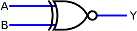

# Circuitos Combinacionais no Digital

### Prof. João Paulo Cerquinho Cajueiro
#### Baseado em slides de Prof. José Rodrigues de Oliveira Neto

Universidade Federal de Pernambuco  
Departamento de Engenharia Mecânica

---

# Mais Portas Lógicas

---

# Porta NAND

- A porta NAND é uma porta AND seguida de um inversor
- Sua saída é o complemento da operação AND
- **Equação:** Y = $\overline{A \cdot B}$

<div style="display: flex; gap: 2em;">
<div style="flex:1;">


</div>
<div style="flex:1;">

| A | B | | Y |
|---|---|-|---|
| 0 | 0 | | 1 |
| 0 | 1 | | 1 |
| 1 | 0 | | 1 |
| 1 | 1 | | 0 |

</div>
</div>

---

# Porta NOR

- A porta NOR é uma porta OR seguida de um inversor
- Sua saída é o complemento da operação OR
- **Equação:** Y = $\overline{A + B}$

<div style="display: flex; gap: 2em;">
<div style="flex:1;">


</div>
<div style="flex:1;">

| A | B | | Y |
|---|---|-|---|
| 0 | 0 | | 1 |
| 0 | 1 | | 0 |
| 1 | 0 | | 0 |
| 1 | 1 | | 0 |

</div>
</div>

</div>

---

# Porta XOR (OU Exclusivo)

- A porta XOR produz saída alta quando as entradas são diferentes
- **Equação:** Y = A ⊕ B = A·$\overline{B}$ + $\overline{A}$·B

<div style="display: flex; gap: 2em;">
<div style="flex:1;">


</div>
<div style="flex:1;">

| A | B | | Y |
|---|---|-|---|
| 0 | 0 | | 0 |
| 0 | 1 | | 1 |
| 1 | 0 | | 1 |
| 1 | 1 | | 0 |

</div>
</div>

</div>

---

# Porta XNOR (Coincidência)

- A porta XNOR é o complemento da porta XOR
- Produz saída alta quando as entradas são iguais
- **Equação:** Y = $\overline{A \oplus B}$ = A·B + $\overline{A}$·$\overline{B}$

<div style="display: flex; gap: 2em;">
<div style="flex:1;">


</div>
<div style="flex:1;">

| A | B | | Y |
|---|---|-|---|
| 0 | 0 | | 1 |
| 0 | 1 | | 0 |
| 1 | 0 | | 0 |
| 1 | 1 | | 1 |

</div>
</div>

---

# Projeto e Análise de Circuitos Simples

---

# Circuitos Digitais

- Podem ser com relés eletromagnéticos, válvulas eletrônicas, diodos, transistores, associação desses componentes, ou circuitos integrados discretos

- **"Porta lógica"** abstrai a implementação para estudar as propriedades dos circuitos digitais

---

# Associação de Portas

É possível associar portas com a saída de uma sendo entrada de outra, criando combinações de funções lógicas

<div class="flex justify-center mt-4">

```
A ----\        ----\
       &-------|    >---- Y
B ----/        |   /
               |  /
C -------------|--
```

**Exemplo:** Y = (A·B) + C

</div>

---

# Exemplo de Projeto - Controle de Forno

**Especificação:**

*"Devemos controlar um forno que deve desligar as resistências sempre que a porta for aberta, deve ligar a resistência quando um sensor (termostato) indicar temperatura baixa, e desligar a resistência quando o sensor indicar que o forno está sobreaquecido"*

---

# Etapa 1 - Traduzir as Variáveis

**Para resolver o projeto:**

1. **Entrada: Porta** ($P$): aberta $P=0$; fechada $P=1$
2. **Entrada: Termostato** ($T$): temperatura baixa $T=0$; sobreaquecimento $T=1$  
3. **Saída do sistema: resistência** ($R$): resistência ligada $R=1$; resistência desligada $R=0$

---

# Etapa 2 - Gerar a Tabela Verdade

<div style="display: flex; gap: 2em;">
<div style="flex:1;">

| **Porta** | **Termostato** | | **Resistência** |
|-----------|----------------|-|-----------------|
| P         | T              | | R               |
| 0         | 0              | | 0               |
| 0         | 1              | | 0               |
| 1         | 0              | | 1               |
| 1         | 1              | | 0               |

</div>
<div style="flex:1;">

**Análise:**
- Se porta aberta (P=0) → resistência sempre desligada
- Se porta fechada (P=1) e temperatura baixa (T=0) → resistência ligada
- Se porta fechada (P=1) e sobreaquecimento (T=1) → resistência desligada

</div>
</div>

---

# Etapa 3 - Extrair a Equação Booleana

<div style="display: flex; gap: 2em;">
<div style="flex:1;">

Da tabela verdade, temos R=1 apenas quando P=1 e T=0:

**R = P · $\overline{T}$**

</div>
<div style="flex:1">

```
P ----\
       &---- R
T̅ ----/
```

</div>
</div>

---

# Exemplo 2 - Sala com 3 Interruptores

<div class="columns">
<div class="column">

**Especificação:**
- Uma sala com 3 portas com interruptores em cada uma delas e uma lâmpada ao centro
- Quando uma pessoa entrar por uma porta ela liga ou desliga o interruptor da porta
- A lâmpada deve acender ou apagar cada vez que um interruptor mudar de estado

</div>
<div class="column">


</div>
</div>

---

# Definindo as Convenções

**Variáveis:**
- **A, B, C:** Estados dos interruptores (0 = desligado, 1 = ligado)
- **LAMPADA:** Estado da lâmpada (0 = apagada, 1 = acesa)

<div class="fragment">

**Lógica:**
- A lâmpada deve estar acesa quando um número ímpar de interruptores estiver ligado
- A lâmpada deve estar apagada quando um número par de interruptores estiver ligado
</div>

---

# Tabela Verdade - 3 Interruptores

<div class="flex justify-center">

| A | B | C | | LAMPADA |
|---|---|---|-|---------|
| 0 | 0 | 0 | | 0       |
| 0 | 0 | 1 | | 1       |
| 0 | 1 | 0 | | 1       |
| 0 | 1 | 1 | | 0       |
| 1 | 0 | 0 | | 1       |
| 1 | 0 | 1 | | 0       |
| 1 | 1 | 0 | | 0       |
| 1 | 1 | 1 | | 1       |
| 1 | 1 | 1 | | 1       |

</div>

---

# Extraindo a Equação Booleana


Da tabela verdade, extraímos a equação para LAMPADA=1:

$LAMPADA = \overline{A}·\overline{B}·C + \overline{A}·B·\overline{C} + A·\overline{B}·\overline{C} + A·B·C$

Esta é a função XOR de três variáveis:

$ LAMPADA = A ⊕ B ⊕ C$

---

# Implementação no Digital

<div class="columns">
<div class="column">

```
A ----\
       =1----\
B ----/        \
                =1---- LAMPADA
C -------------/
```
</div>
<div class="column">

- Simulação em tempo real
- Interface gráfica intuitiva
- Verificação de funcionamento
- Geração de circuitos otimizados

</div>

---

# Recursos do Digital

**Principais funcionalidades:**
- Biblioteca completa de portas lógicas
- Componentes de entrada (chaves, botões)
- Componentes de saída (LEDs, displays)
- Ferramentas de análise (tabela verdade, minimização)
- Simulação passo a passo
- Exportação de circuitos

- https://github.com/hneemann/Digital/releases/latest

---

# Bibliografia

- RANHEL, João. **"Eletrônica Digital, Verilog e FPGA"**, 1ª ed., Clube do Autor, 2021.

- CAJUEIRO, J. P. C., **Álgebra de Boole**, Notas de Aula, 19 de agosto de 2009.

- Link para download do Digital: https://github.com/hneemann/Digital/releases/latest