# Mapas de Karnaugh

### Prof. João Paulo Cerquinho Cajueiro

Universidade Federal de Pernambuco  
Departamento de Engenharia Mecânica

---

# Mapas de Karnaugh

---

# Diagrama de Venn

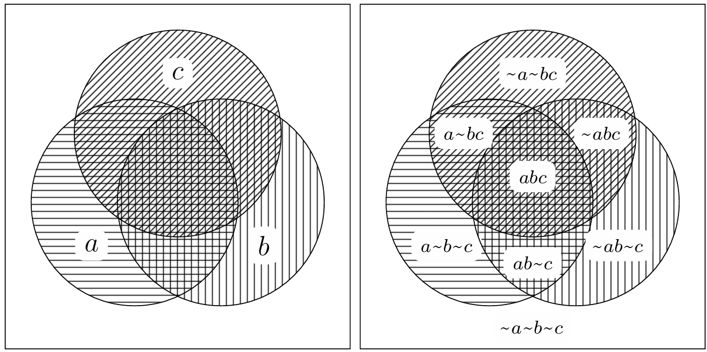

---

# Função lógica no Venn


<div style="display: flex; gap: 2em;">
<div style="flex:1;">

$f1 = a\overline{b}\overline{c} + a\overline{b}c + \overline{a}\overline{b}c$

$f1 = (a + c)\cdot\overline{b}$

</div>
<div style="flex:1;">

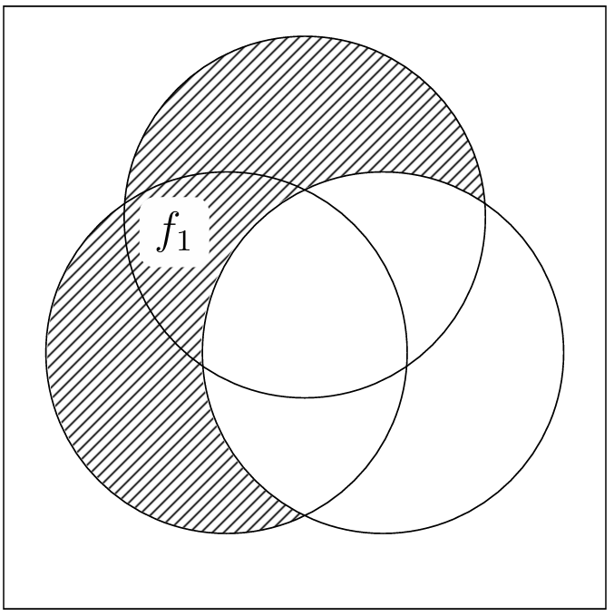

</div>

</div>

---

# E com 4 variáveis?

---

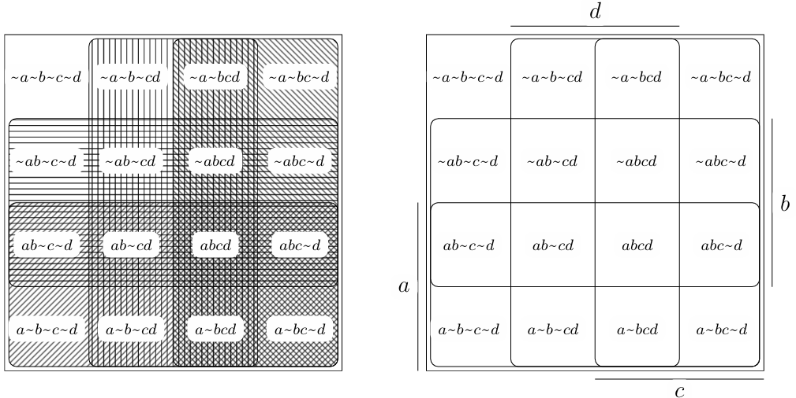

---

# De Venn a Karnaugh

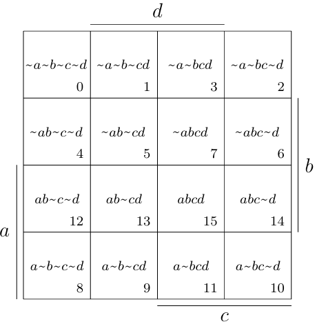

---

# Função lógica no Karnaugh


<div style="display: flex; gap: 2em;">
<div style="flex:1;">

$f2 = f2 =\overline{a}\overline{b}cd +\overline{a}bcd + ab\overline{c}\overline{d} + ab\overline{c}d$

$f2 = \overline{a}cd + ab\overline{c}$

</div>
<div style="flex:1;">

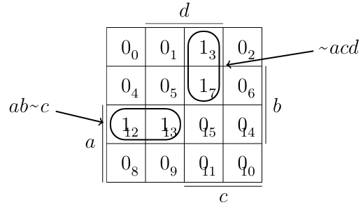

</div>

</div>

---

# Função lógica no Karnaugh

<div style="display: flex; gap: 2em;">
<div style="flex:1;">

O agrupamento de 2 casas vizinhas corresponde a simplicação de uma
 variável através da aplicação do teorema 6.

</div>
<div style="flex:1;">


</div>

</div>

---

# 4 casas

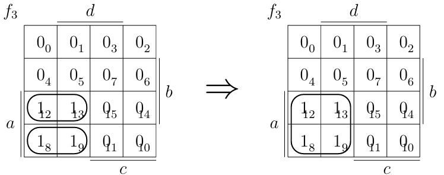

$f3 = a\overline{b}\overline{c}\overline{d} + a\overline{b}\overline{c}d + ab\overline{c}\overline{d} + ab\overline{c}d$

---


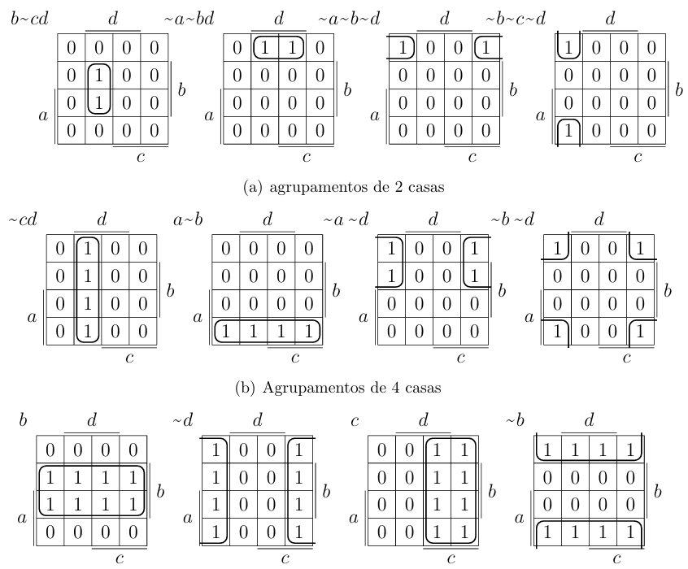

---

# Karnaugh de 2, 3 e 4 variáveis

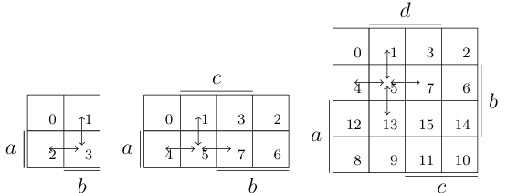

---

# Karnaugh 3d de 6 variáveis

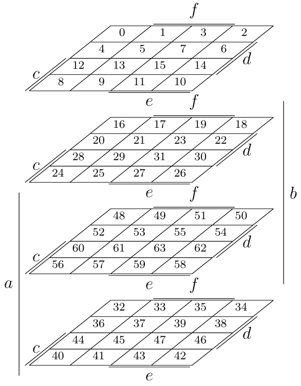

---

# 5 variáveis (expandido)

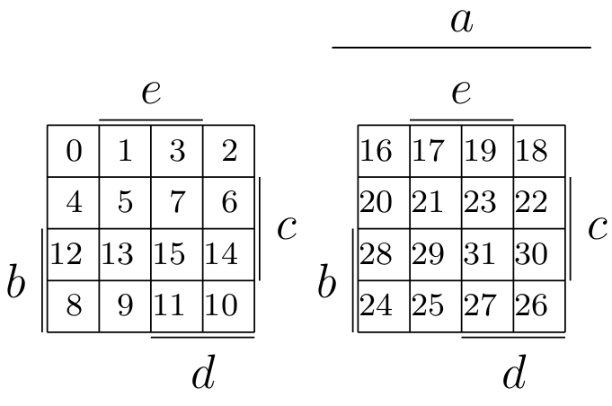

---

# 6 variáveis (expandido)

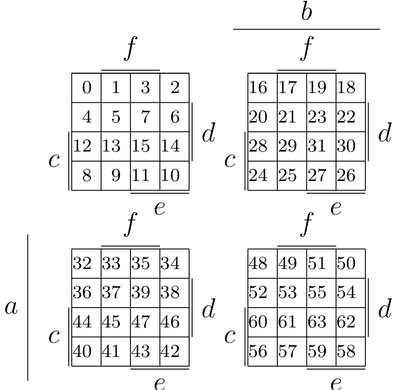

---

# Karnaugh por zeros (dual)

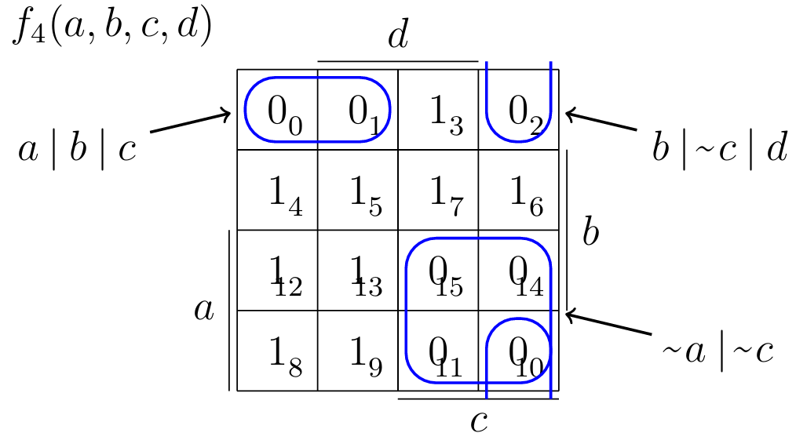

$f_4 = (\overline{a} + \overline{c})(a + b + c)(b + \overline{c} + d)$

---

<div class="columns">
<div class="column">
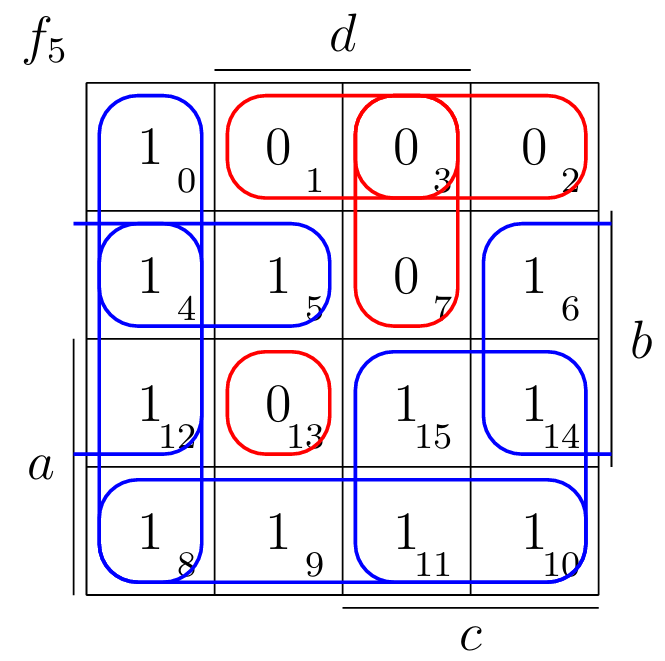
</div>
<div class="column">

$f_5 =  a\overline{b} + ac + b\overline{d} + \overline{c}\overline{d} + \overline{a}b\overline{c}$

$f_5 =  (a + b + \overline{c})(a + b + \overline{d})(a + \overline{c} + \overline{d})(\overline{a} + \overline{b} + c + \overline{d}) $

---

# Sistemas não completamente especificados

- Imagine uma esteira carregando uma caixa de um lado para o outro
- Sensores de fim de curso em ambas extremidades: $s_e$ e $s_d$
- Normalmente estes dois sinais nunca serao acionados ao mesmo tempo
- Logo saída não importa para $s_e=s_d=1$

---

<div style="display: flex; gap: 2em;">
<div style="flex:1;">
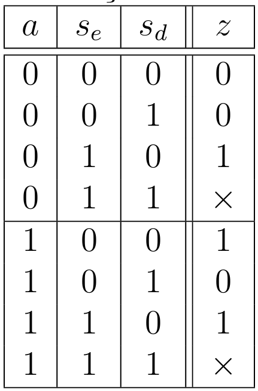
</div>
<div style="flex:1;">
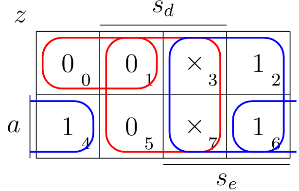

$z_0 = \overline{s_d}\cdot(s_e + a)$

$z_1 = s_e + \overline{s_d}a$

$z_0 \neq z_1$

</div>
</div>

---

# Etapa 3 - Extrair a Equação Booleana

<div style="display: flex; gap: 2em;">
<div style="flex:1;">

Da tabela verdade, temos R=1 apenas quando P=1 e T=0:

**R = P · $\overline{T}$**

</div>
<div style="flex:1">

```
P ----\
       &---- R
T̅ ----/
```

</div>
</div>

---

# Exemplo 2 - Sala com 3 Interruptores

<div class="columns">
<div class="column">

**Especificação:**
- Uma sala com 3 portas com interruptores em cada uma delas e uma lâmpada ao centro
- Quando uma pessoa entrar por uma porta ela liga ou desliga o interruptor da porta
- A lâmpada deve acender ou apagar cada vez que um interruptor mudar de estado

</div>
<div class="column">


</div>
</div>

---

# Definindo as Convenções

**Variáveis:**
- **A, B, C:** Estados dos interruptores (0 = desligado, 1 = ligado)
- **LAMPADA:** Estado da lâmpada (0 = apagada, 1 = acesa)

<div class="fragment">

**Lógica:**
- A lâmpada deve estar acesa quando um número ímpar de interruptores estiver ligado
- A lâmpada deve estar apagada quando um número par de interruptores estiver ligado
</div>

---

# Tabela Verdade - 3 Interruptores

<div class="flex justify-center">

| A | B | C | | LAMPADA |
|---|---|---|-|---------|
| 0 | 0 | 0 | | 0       |
| 0 | 0 | 1 | | 1       |
| 0 | 1 | 0 | | 1       |
| 0 | 1 | 1 | | 0       |
| 1 | 0 | 0 | | 1       |
| 1 | 0 | 1 | | 0       |
| 1 | 1 | 0 | | 0       |
| 1 | 1 | 1 | | 1       |
| 1 | 1 | 1 | | 1       |

</div>

---

# Extraindo a Equação Booleana


Da tabela verdade, extraímos a equação para LAMPADA=1:

$LAMPADA = \overline{A}·\overline{B}·C + \overline{A}·B·\overline{C} + A·\overline{B}·\overline{C} + A·B·C$

Esta é a função XOR de três variáveis:

$ LAMPADA = A ⊕ B ⊕ C$

---

# Implementação no Digital

<div class="columns">
<div class="column">

```
A ----\
       =1----\
B ----/        \
                =1---- LAMPADA
C -------------/
```
</div>
<div class="column">

- Simulação em tempo real
- Interface gráfica intuitiva
- Verificação de funcionamento
- Geração de circuitos otimizados

</div>

---

# Recursos do Digital

**Principais funcionalidades:**
- Biblioteca completa de portas lógicas
- Componentes de entrada (chaves, botões)
- Componentes de saída (LEDs, displays)
- Ferramentas de análise (tabela verdade, minimização)
- Simulação passo a passo
- Exportação de circuitos

- https://github.com/hneemann/Digital/releases/latest

---

# Bibliografia

- RANHEL, João. **"Eletrônica Digital, Verilog e FPGA"**, 1ª ed., Clube do Autor, 2021.

- CAJUEIRO, J. P. C., **Álgebra de Boole**, Notas de Aula, 19 de agosto de 2009.

- Link para download do Digital: https://github.com/hneemann/Digital/releases/latest