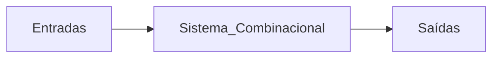
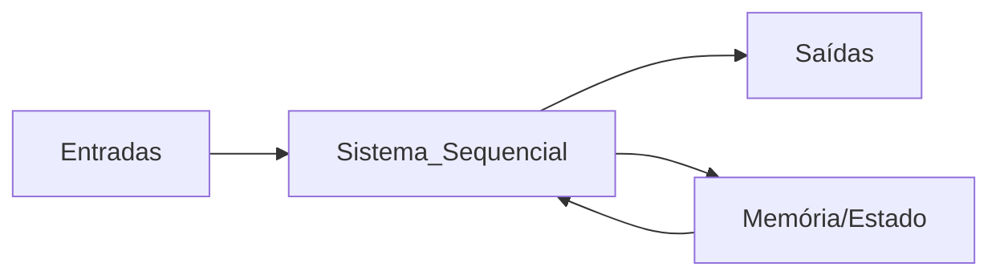

# Lógica Sequencial

### Prof. João Paulo Cerquinho Cajueiro
#### Baseado em slides de Prof. José Rodrigues de Oliveira Neto

Universidade Federal de Pernambuco  
Departamento de Engenharia Mecânica

---

# Introdução

---

# Circuitos com Memória

- Até agora - sistemas ditos combinacionais

- Ou seja, cuja a saída dependa apenas do estado atual das entradas:




**Saída = f(Entradas atuais)**

---

# Necessidade de Memória

- Vários sistemas realizam uma sequência de ações diferentes para um mesmo comando

- A saída desses sistemas não dependem apenas da entrada em um dado instante de tempo, mas do **estado** atual dele

- Ou seja, o sistema precisa guardar informação sobre as ações que já foram realizadas, ou seja, o sistema necessita ter **memória**


---

# Sistema Sequencial

<div class="flex justify-center">



**Saída = f(Entradas atuais, Estado anterior)**

</div>
</div>

---

# Latch

---

# Latch com Inversores

<div class="columns">
<div class="column">
- Existem várias maneiras de guardar informação digital, 
- Uma das mais simples são os *latches*
- Analisemos o sistema ao lado:

</div>

<div class="column">


</div>


---

# Latch com Transistores de Passagem

# Latch Transparente

<div class="columns">
<div class="column">


</div>

<div class=column>

**Funcionamento:**
- Quando EN = 1: Q segue D (transparente)
- Quando EN = 0: Q mantém o último valor de D (memória)

</div>
</div>

---

# Tabela Verdade do Latch Transparente

<div class="flex justify-center">

| EN | D | Q(t+1) | Operação |
|----|---|--------|----------|
| 0  | X | Q(t)   | Manter   |
| 1  | 0 | 0      | Reset    |
| 1  | 1 | 1      | Set      |

</div>

<v-clicks>

**Características:**
- **Transparente:** Quando habilitado, a saída segue a entrada
- **Memória:** Quando desabilitado, mantém o estado anterior
- **Nível sensitivo:** Responde ao nível do sinal de controle

</v-clicks>

---

# Análise temporal

---

# Capacidade de Memória

- Isso significa que um *latch* tem capacidade de memorizar um bit de dado digital presente na entrada **D** na transição que desabilita (transição de descida) o *enable*

- Esta é a base da memória digital: a capacidade de armazenar informação binária

---

# Latch com Portas Lógicas

<div class="columns">
<div class="column">


**Latch SR com portas NOR**

</div>

<div class="column">

| S | R | Q | Q̅ | | Operação |
|---|---|---|---|-|----------|
| 0 | 0 | Q | Q̅ | | Manter   |
| 0 | 1 | 0 | 1 | | Reset    |
| 1 | 0 | 1 | 0 | | Set      |
| 1 | 1 | 0 | 0 | | Proibido |

</div>

---

# Latch com Portas Lógicas

<div class="columns">
<div class="column">


**Latch SR com portas NAND**

</div>

<div class="column">

| S | R | Q | Q̅ | | Operação |
|---|---|---|---|-|----------|
| 0 | 0 | Q | Q̅ | | Manter   |
| 0 | 1 | 0 | 1 | | Reset    |
| 1 | 0 | 1 | 0 | | Set      |
| 1 | 1 | 0 | 0 | | Proibido |

</div>

---

# Latch Transparente tipo D com Portas Lógicas


---

# Circuitos Sensíveis à Bordas

---

# Como construir um Detector de Bordas

- Enquanto *enable* (**EN**) estiver ativo a saída **Q** do circuito se modifica

- Nem sempre se quer que transições da entrada **D** se propaguem imediatamente para saída **Q**

- Para esses casos, alguns circuitos discretos colocam sensores de borda de subida ou de descida no sinal de controle

---

# Detector de Bordas


---

# Diferença entre Latches e Flip-Flops

- **LATCHs** - são transparentes e tem estados em que a saída varia continuamente com a entrada

- **FLIP-FLOP** - alteram as saídas em função das entradas apenas na subida ou descida do sinal de *clock*. Não são transparentes

---

# Comparação: Latch vs Flip-Flop

<div class="columns">

<div class="column">

```
Latch D:

            ┌─────┐
D ──────────┤D    ├─── Q
            │     │
EN ─────────┤     ├─── Q̅
            └─────┘

Flip-Flop D:

            ┌─────┐
D ──────────┤D    ├─── Q
            │     │
CLK ────────┤>    ├─── Q̅
            └─────┘
```

</div>

<div class="column">

**Principais diferenças:**
- **Latch:** Sensível ao nível (transparente quando EN=1)
- **Flip-Flop:** Sensível à borda (muda apenas na transição do clock)

</div>

</div>

---

# Bibliografia

- RANHEL, João. **"Eletrônica Digital, Verilog e FPGA"**, 1ª ed., Clube do Autor, 2021.

- Tutorial Logisim: http://www.cburch.com/logisim/docs/2.7/pt/html/guide/index.html
