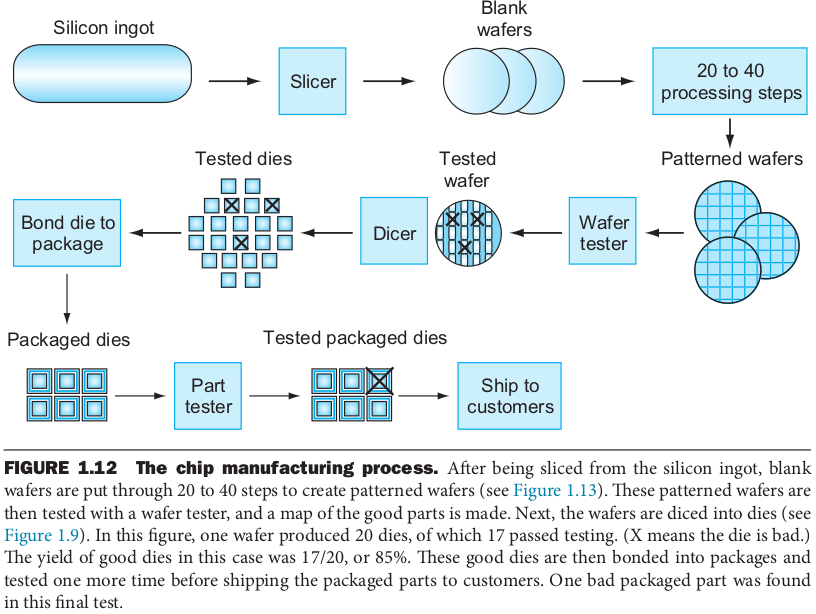
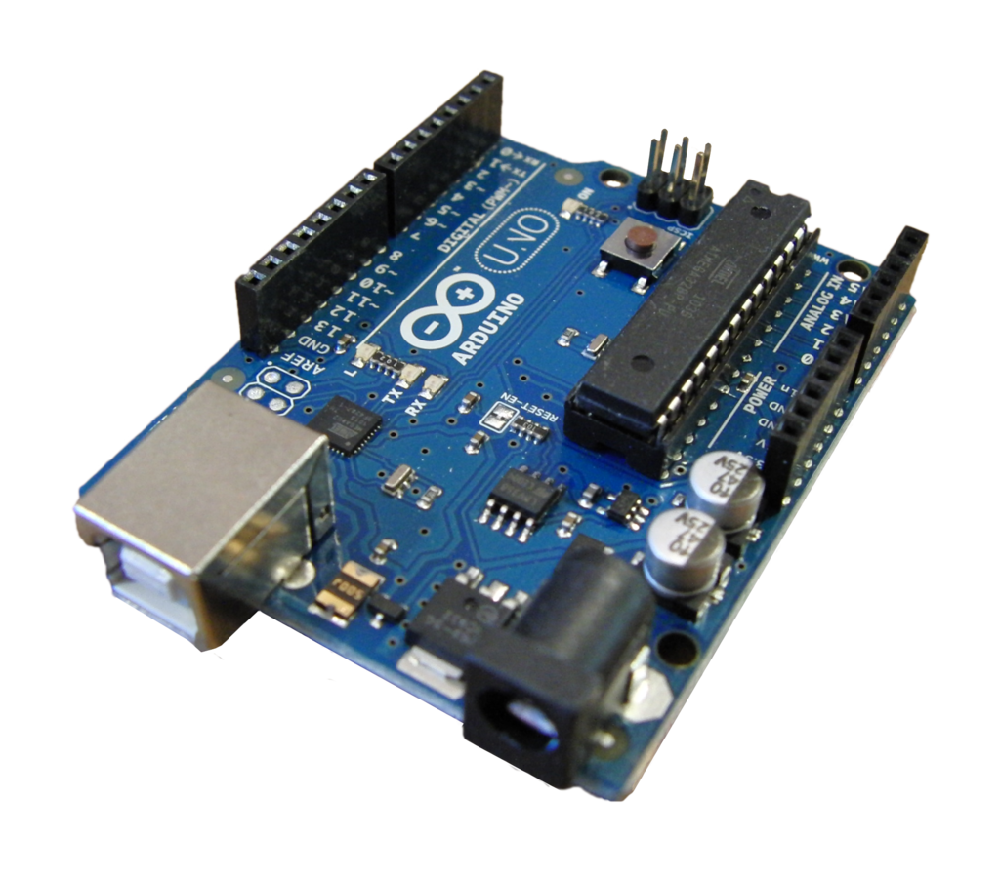

# Introdução aos Sistemas Microcontrolados
### Prof. João Paulo Cerquinho Cajueiro
#### Baseado em slides de Prof. José Rodrigues de Oliveira Neto

Universidade Federal de Pernambuco  
Departamento de Engenharia Mecânica

---

## Introdução aos Sistemas Embarcados

### O que é um sistema embarcado

* Sistema eletrônico para um propósito específico.
* Hardware (Eletrônica) + Software (Computação) + Mecânica (Limitações físicas/Interface com o mundo).
* Parte de um sistema maior.
* Se diferencia dos computadores de uso geral.

---

## Uma classe específica de sistema computadorizado. 

---

### Classes de computadores quanto a sua aplicação

* **Computador pessoal (PC)**: um computador projetado para ser usado por um indivíduo, geralmente incorporando um monitor, um teclado e um mouse.
* **Servidor:** um computador usado para executar programas maiores para vários usuários, muitas vezes simultaneamente, e normalmente acessado apenas através de uma rede.
* **Supercomputador:** uma classe de computadores com o mais alto desempenho e custo; eles são configurados como servidores e normalmente custam dezenas a centenas de milhões de dólares.
* **Computador embarcado:** um computador dentro de outro dispositivo usado para executar um aplicativo predeterminado ou coleção de softwares predeterminada.

---

### Heterogeneidade

* Cada Sistema Embarcado possui um hardware único ou a customização de um hardware padrão.

  * Esse hardware pode variar quanto ao uso de:
    * **Arquiteturas do processador;**
    * **Memórias;**
    * **Fontes de clock;**
    * **Fornecedores;**
    * **Periféricos de Comunicação;**
    * **Periféricos Conversores;**
    * **Alimentação;** 
    * **Coprocessadores.**

  

  <small>Fonte - (GARCIA, 2018).</small>

---

### Restrições

* **Financeiras:** custo do projeto + fabricação + logística + assistência, concorrência (para produtos de larga escala), ou pouca demanda.
* **Dimensionais:** produtos portáteis, parte de sistemas maiores.
* **de Consumo e Autonomia:** aparelhos portáteis, sensoriamento em lugares remotos, etc. 
* **de Recursos Computacionais:** baixo processamento, pouca memória, número limitado de sensores e/ou atuadores.
* **Temporais:** Real-Time Systems.   

---

### Complexidade

* Sistemas médicos.
* Aviões e automóveis.
* Aplicações industriais.
* Alta conectividade, alta heterogeneidade.

---

## Organização de Computadores

---

### As partes que integram um sistema microprocessado

<small>Fonte - (PATTERSON, 2017).</small>

---

<!-- ### Preço do processamento: -->

<!--  -->

<small>Fonte - (PATTERSON, 2017).</small>

---

### Evolução da Tecnologia das Portas Lógicas:

<small>Fonte - (PATTERSON, 2017).</small>

---

### Válvulas - *Vacuum tube*

---

### Transistores

---

### Produção de um CI:

<small>Fonte - (PATTERSON, 2017).</small>

---

### Método Chokhralsky de Produção de Silício:

<small>Fonte - https://medium.com/@solar.dao/silicon-ingots-and-wafers-production-c75da33337a5.</small>

---

### Método Chokhralsky de Produção de Silício:

<small>Fonte - https://medium.com/@solar.dao/silicon-ingots-and-wafers-production-c75da33337a5.</small>

---

### Diagrama em blocos do processo de produção de um CI:

<small>Fonte - (PATTERSON, 2017).</small>

---

### Chips em um *wafer*:

<small>Fonte - (PATTERSON, 2017).</small>

---

### Produção de um CI:

<small>Fonte - (PATTERSON, 2017).</small>

---

### Apple A5

<small>Fonte - (PATTERSON, 2017).</small>

---

<small>Fonte - (wikipedia).</small>

---

### Abstração entre Hardware e Software:

<small>Fonte - (PATTERSON, 2017).</small>

---

### Da linguagem de programação de Alto-nível de abstração para linguagem de máquina:

<small>Fonte - (PATTERSON, 2017).</small>

---

### Da linguagem de programação de Alto-nível de abstração para linguagem de máquina:

<small>Fonte - (PATTERSON, 2017).</small>

---

### Da linguagem de programação de Alto-nível de abstração para linguagem de máquina:

<small>Fonte - (PATTERSON, 2017).</small>

---

## Microcontroladores

Formados por:
* Núcleo de processamento.
* Memórias.
* Periféricos.

<small>Fonte - (GARCIA, 2018).</small>

---

Os microcontroladores são formados por:
* Núcleo de processamento.
* Memórias.
* Periféricos.

<small>Fonte - (GARCIA, 2018).</small>

---

### Núcleo de Processamento (CPU)

* Unidade Lógica Aritmética.
* Unidade de Controle.
* Registradores.
* Unidade de Controle de Interrupções.

---

### Unidade Lógica Aritmética (ULA)

Desenvolvido em 1946 por Von Neumann - Princeton - Institute for Advanced Study - IAS. 

* **Sistema Numérico:** Complemento a dois.
* **Realiza Operações simples:**
    * Aritméticas ( $+$, $-$ , $<$, $>$ , $\leq$, $\geq$, $=$ , $\neq$ ).
    * Lógicas (**OR**, **AND**, **NOT**).
    * Deslocamento (*shift, rotate*).

---

### Unidade de Controle

É a responsável por buscas, decodificar e executar as instruções.

1. Busca a instrução na memória de programa.
2. Decodifica a instrução: 
    * A instrução utilizará a ULA? 
    * Utilizará registradores? 
    * Acessará a memória? 
3. Executa a instrução.
    * Movimentação dos dados.
    * Processamento dos dados.
    * Armazenamento dos dados.

<small>Fonte - (GARCIA, 2018).</small>

---

## Arduino

* Arduino é uma plataforma de prototipagem eletrônica de hardware e software livre. 
* O projeto Arduino começou em 2005 como um programa para estudantes do **Instituto de Design de Interação Ivrea**, em Ivrea, Itália, com o objetivo de fornecer uma maneira fácil e de baixo custo para iniciantes e profissionais criarem dispositivos que interagem com seu ambiente usando sensores e atuadores.

<small>Fonte - https://pt.wikipedia.org/wiki/Arduino</small>

---

---

* As placas possuem interfaces de comunicação serial (USB) que são usadas para carregar programas de computadores pessoais.
* A plataforma Arduino é programada utilizando linguagem de programação fortemente baseada em C/C++.
* O projeto Arduino fornece um ambiente de desenvolvimento integrado (IDE) baseado no projeto da linguagem Processing.

---

## Bibliografia

* PATTERSON, David A., HENESSY, John L. ,**Computer Organization and Design ARM Edition: The Hardware Software Interface**, Elsevier, USA, ISBN: 978-0-12-801733-3, 2017.
* STADZISZ, P. C.; RENAUX, D. P. B. **In: Sistemas embarcados**, 1st. ed. Guarapuava: SBC, 2007. cap. Software Embarcado, p. 107–155.
* GARCIA, F. D., **Introdução aos sistemas embarcados e microcontroladores**, Disponível em:  https://www.embarcados.com.br/sistemas-embarcados-e-microcontroladores/, Portal Embarcados, 2018. 

