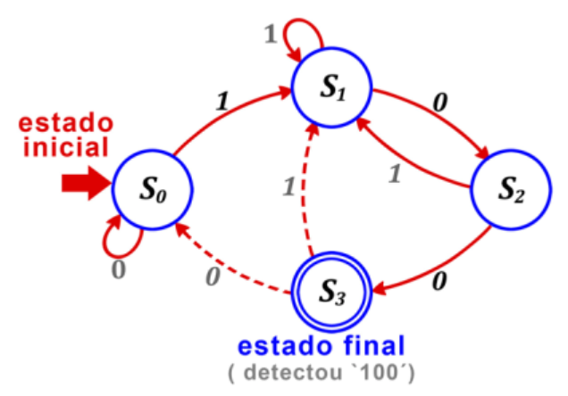
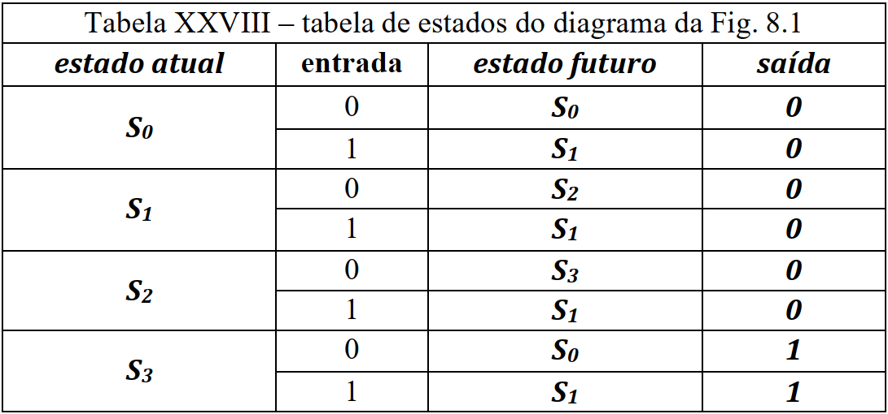
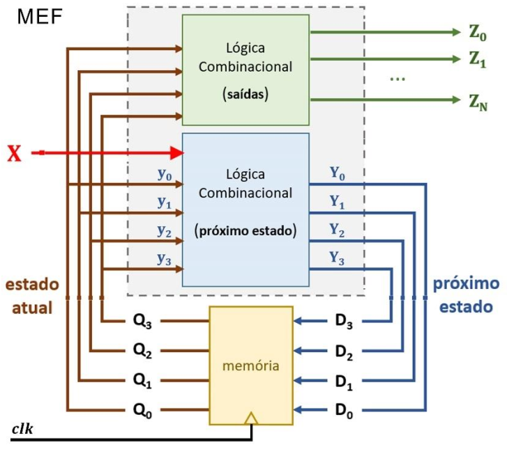
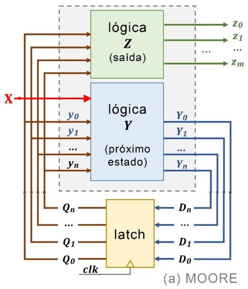
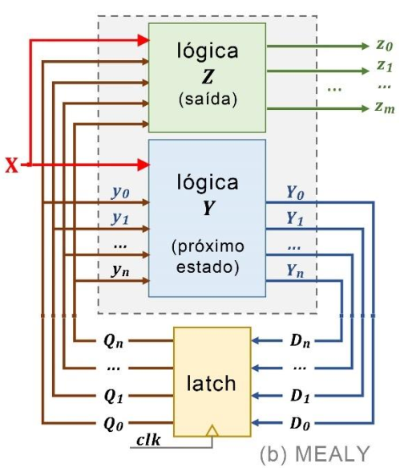

# Máquina de Estados Finitos

### Prof. João Paulo Cerquinho Cajueiro
#### Baseado em slides de Prof. José Rodrigues de Oliveira Neto

Universidade Federal de Pernambuco  
Departamento de Engenharia Mecânica

---

# Conceito de MEF

* Máquina de Estados Finitos (MEF), em inglês *Finite State Machine* (FSM), *finite-state automaton* (FSA), máquina de estados finita, ou ainda autômato finito, é uma abstração, um modelo matemático usado para modelar uma gama de problemas:
    * gramática de linguagens naturais;
    * projeto de automação (sistemas dinâmicos controlados por eventos);
    * protocolos de comunicação;
    * programas de computadores;
    * decomposição (*parsing*) em compiladores; 
    * etc.
* **Circuitos Lógicos Sequenciais são mais facilmente descritos na forma de FSM.**

---

# Características de uma MEF

* Máquina abstrata que deve estar em um de um número **finito** de **estados**.
* Apenas um estado por vez - **estado atual**.
* **Transição** - mudança de um estado para outro.
* Uma **condição** é necessária para que a transição ocorra.
* Uma **ação** é uma atividade que deve ser realizada num determinado momento.
  * **Ações de entrada** quando um agente externo provoca um estímulo à máquina.
  * **Ações de saída** - algum tipo de atuação desse sistema no mundo.

---

# Formas de Representação

<!-- Assim como as funções lógicas, MEFs também tem diversas formas de representação: -->
1. Modelo matemático.
2. Diagrama de Estados;
3. Blocos lógicos e Diagrama Elétrico;
4. Tabela de Eventos;

---

# Modelo Matemático

Matematicamente, uma máquina de estados finita é uma séxtupla:

  $\langle \Sigma, \Gamma, S, S_0, \delta, \omega\rangle$

em que:
  * $\Sigma$ - é o alfabeto de entrada, um conjunto finito não vazio de símbolos;
  * $\Gamma$ - é o alfabeto de saída, um conjunto não vazio;
  * $S$ - é o conjunto não vazio de estados;
  * $S_0$ - é o estado inicial: $S_o \in S$;
  * $\delta$ - é a função de transição: $\delta: S\times\Sigma \rightarrow S$;
  * $\omega$ - é a função de saída:
      * **Mealy:** $\omega : S \times \Sigma \rightarrow \Gamma$;
      * **Moore:** $\omega : S \rightarrow \Gamma.$

---

# Diagrama de Estados

Um diagrama de estados é uma representação gráfica:

1. dos estados pelos quais um sistema pode passar;
2. das transições que ocorrem entre estados;
3. dos eventos (ações e condições) que causam transições;
4. **das saídas que a máquina gera no decorrer da execução de processos de um sistema.**

  
  

  <small>Fonte - (RANHEL, 2021).</small>

--

A FSM da figura detecta uma sequência de entrada "100".
Podemos associar ao diagrama a sextupla que caracteriza essa FSM:
* $\Sigma = \{0,1\}$ - alfabeto de entrada do sistema;
* $\Gamma = \{0,1\}$ - alfabeto de saída do sistema;
* $S = \{S_0, S_1, S_2, S_3\}$ ;
* $S_0$ - é o estado inicial: $S_o \in S$;

  
  

  <small>Fonte - (RANHEL, 2021).</small>

---

# Tabela de Estados/Eventos

A **Tabela de Estados/Eventos** descreve as funções de transição $\delta$ e de saída do sistema $\omega$:

  

  <small>Fonte - (RANHEL, 2021).</small>

---

# Blocos Lógicos e Diagrama Elétrico

* Uma forma de visualizar como é uma FSM em um circuito de eletrônica digital é desenhar um diagrama de blocos lógicos compostos pelos elementos vistos até o momento.
* O primeiro elemento a ser incorporado a um circuito FSM é um registrador criado com Flip-Flops (FF).
* As transições podem ser implementadas a partir de portas lógicas cujas entradas são tanto o estado atual quando as entradas do sistema.
* As saídas do sistema também podem ser implementadas através do estado atual do sistema (com ou não as entradas do sistema, mas varemos melhor em slides posteriores).

--

# Diagrama de blocos genérico.

  * $\mathbf{Z} \rightarrow$ saídas;
  * $\mathbf{X} \rightarrow$ entradas;
  * $\mathbf{y} \rightarrow$ estado atual;
  * $\mathbf{Y} \rightarrow$ estado futuro;

  
  <small>Fonte - (RANHEL, 2021).</small>

---

# Implementando no Digital

* Implementar máquina de estados que reconhece a sequência de entrada ``100'';
* Não existe um único jeito de implementar o sistema, nem um único jeito de atacar o problema;
* No entanto, sempre é salutar **sistematizar** o **projeto** de sistemas digitais sequenciais, seja para agilizar a implementação, reduzir as chances de erro, facilitar a análise dos resultados obtidos ou mesmo ajudar na organização do projeto.

--

* Seguiremos (e sugerimos que sigam) a seguinte ordem no projeto do sistema:
    1. Definição dos estados e a memória necessária para guardar o valor do estado atual;
    2. Projeto da lógica combinacional que gera o estado futuro a partir do estado atual e das entradas;
    3. Projeto da lógica combinacional que gera a saída do sistema a partir do estado atual.

--

### Definição dos Estados - One-Hot

* No nosso exemplo temos 4 estados possíveis: $\mathbf{S} = \{S_0, S_1, S_2, S3\}$.
* A princípio, poderíamos guardar cada um desses estados em um FF diferente em que se o valor guardado FF fosse `1' indicaria que a FSM se encontra naquele estado e que não se encontra caso o FF guarde o valor `0'.

| **Estado** | **D3** | **D2** | **D1** | **D0** |
|---|---|---|---|---|
| $S_0$ | 0 | 0 | 0 | 1 |
| $S_1$ | 0 | 0 | 1 | 0 |
| $S_2$ | 0 | 1 | 0 | 0 |
| $S_3$ | 1 | 0 | 0 | 0 |

--

### Diagrama de blocos com um circuito genérico digital que funciona como um FSM.

* $\mathbf{Z} \rightarrow$ saídas;
* $\mathbf{X} \rightarrow$ entradas;
* $\mathbf{y} \rightarrow$ estado atual;
* $\mathbf{Y} \rightarrow$ estado futuro;

  
  <small>Fonte - (RANHEL, 2021).</small>

--

### Definição dos Estados - Memória Mínima

* Uma outra forma de implementar é utilizando apenas o número necessário de memória:
* se temos 4 estados e sabemos que $n$ bits podem representar até $2^n$ combinações diferentes, dois FF ($2^2 = 4$) podem representar cada um dos estados possíveis da nossa FSM.

| **Estado** | **D1** | **D0** |
|---|---|---|
| $S_0$ | 0 | 0 |
| $S_1$ | 0 | 1 |
| $S_2$ | 1 | 0 |
| $S_3$ | 1 | 1 |

--

### Transições entre Estados

* Mapear o estado atual $\mathbf{y} = \{y_1, y_0\} = \{\mathbf{Q1}, \mathbf{Q0}\}$ e as entradas $\mathbf{X} = \{x_0\}$ nas saídas $\mathbf{Y} = \{Y_1, Y_0\} = \{\mathbf{D1}, \mathbf{D0}\}$ em uma Tabela de Estados/Eventos:

  
  <small>Fonte - (RANHEL, 2021).</small>

--

| Entradas | Saídas |
|---|---|
| $x_0$ **Q1** **Q0** | **D1** **D0** |
|---|---|
| 0 0 0 | 0 0 |
| 0 0 1 | 1 0 |
| 0 1 0 | 1 1 |
| 0 1 1 | 0 0 |
| 1 0 0 | 0 1 |
| 1 0 1 | 0 1 |
| 1 1 0 | 0 1 |
| 1 1 1 | 0 1 |

--

* Para implementar a lógica de transição, é interessante já mapear o estado atual $\mathbf{y} = \{y_1, y_0\} = \{\mathbf{Q1}, \mathbf{Q0}\}$ e as entradas **X** = $\{x_0\}$ nas saídas $\mathbf{Y} = \{Y_1, Y_0\} = \{\mathbf{D1}, \mathbf{D0}\}$ em uma Tabela de Estados/Eventos:

  
  <small>Fonte - (RANHEL, 2021).</small>

--

| Entradas | Saídas |
|---|---|
| $x_0$ **Q1** **Q0** | **D1** **D0** |
|---|---|
| 0 0 0 | 0 0 |
| 0 0 1 | 1 0 |
| 0 1 0 | 1 1 |
| 0 1 1 | 0 0 |
| 1 0 0 | 0 1 |
| 1 0 1 | 0 1 |
| 1 1 0 | 0 1 |
| 1 1 1 | 0 1 |

--

$\mathbf{D1} = \overline{x_0}.\overline{\mathbf{Q1}}.\mathbf{Q0} + \overline{x_0}.\mathbf{Q1}.\overline{\mathbf{Q0}}$
$\mathbf{D1} = \overline{x_0}(\overline{\mathbf{Q1}}.\mathbf{Q0} + \mathbf{Q1}.\overline{\mathbf{Q0}})$ 
  $\mathbf{D1} = \overline{x_0}(\mathbf{Q1} \oplus \mathbf{Q0})$

* Para implementar a lógica de transição, é interessante já mapear o estado atual $\mathbf{y} = \{y_1, y_0\} = \{\mathbf{Q1}, \mathbf{Q0}\}$ e as entradas **X** = $\{x_0\}$ nas saídas $\mathbf{Y} = \{Y_1, Y_0\} = \{\mathbf{D1}, \mathbf{D0}\}$ em uma Tabela de Estados/Eventos:

| Entradas | Saídas |
|---|---|
| $x_0$ **Q1** **Q0** | **D1** **D0** |
|---|---|
| 0 0 0 | 0 0 |
| 0 0 1 | 1 0 |
| 0 1 0 | 1 1 |
| 0 1 1 | 0 0 |
| 1 0 0 | 0 1 |
| 1 0 1 | 0 1 |
| 1 1 0 | 0 1 |
| 1 1 1 | 0 1 |

--

  $\mathbf{D0} = (x_0 + \mathbf{Q1} + \mathbf{Q0})(x_0 + \mathbf{Q1} + \overline{\mathbf{Q0}})(x_0 + \overline{\mathbf{Q1}} + \overline{\mathbf{Q0}})$ 
  $\mathbf{D0} = (x_0 + \mathbf{Q1})(x_0 + \overline{\mathbf{Q1}} + \overline{\mathbf{Q0}})$ 
  $\mathbf{D0} = x_0 + \mathbf{Q1}\overline{\mathbf{Q0}}.$ 

--

### Definição das Saídas

* Agora que nossa FSM já está está trocando de estado corretamente dependendo do estado atual e das entradas, basta fazer a lógica necessária para definir as saídas $\mathbf{Z} = z_0$.

  
  <small>Fonte - (RANHEL, 2021).</small>

  <!-- 
  <small>Fonte - (RANHEL, 2021).</small> -->

--

* Agora que nossa FSM já está está trocando de estado corretamente dependendo do estado atual e das entradas, basta fazer a lógica necessária para definir as saídas $\mathbf{Z} = z_0$.

  
  <small>Fonte - (RANHEL, 2021).</small>

--

| Entradas | Saídas |
|---|---|
| $x_0$ **Q1** **Q0** | $z_0$ |
|---|---|
| 0 0 0 | 0 |
| 0 0 1 | 0 |
| 0 1 0 | 0 |
| 0 1 1 | 1 |
| 1 0 0 | 0 |
| 1 0 1 | 0 |
| 1 1 0 | 0 |
| 1 1 1 | 1 |

--

  * Agora que nossa FSM já está está trocando de estado corretamente dependendo do estado atual e das entradas, basta fazer a lógica necessária para definir as saídas $\mathbf{Z} = z_0$.

| Entradas | Saídas |
|---|---|
| $x_0$ **Q1** **Q0** | $z_0$ |
|---|---|
| 0 0 0 | 0 |
| 0 0 1 | 0 |
| 0 1 0 | 0 |
| 0 1 1 | 1 |
| 1 0 0 | 0 |
| 1 0 1 | 0 |
| 1 1 0 | 0 |
| 1 1 1 | 1 |

  $z_0 = \mathbf{Q1 Q0}.$

--

## Máquinas Moore e Mealy

* A diferença entre a classe de máquinas Moore e Mealy está apenas na lógica combinacional que produz o vetor de saída **Z**.
* Nas máquinas Moore apenas o estado atual é utilizado para gera as saídas;
* Enquanto que nas máquinas Mealy além do estado atual, as entradas são utilizadas para as entradas para definir as saídas.

  
  <small>Fonte - (RANHEL, 2021).</small>

  
  <small>Fonte - (RANHEL, 2021).</small>

---

## Bibliografia

* RANHEL, João. ``**Eletrônica Digital, Verilog e FPGA**'', 1$^a$ ed., Clube do Autor, 2021.
* Tutorial Logisim: http://www.cburch.com/logisim/docs/2.7/pt/html/guide/index.html

