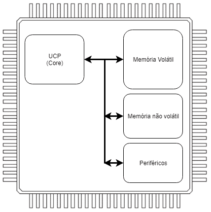
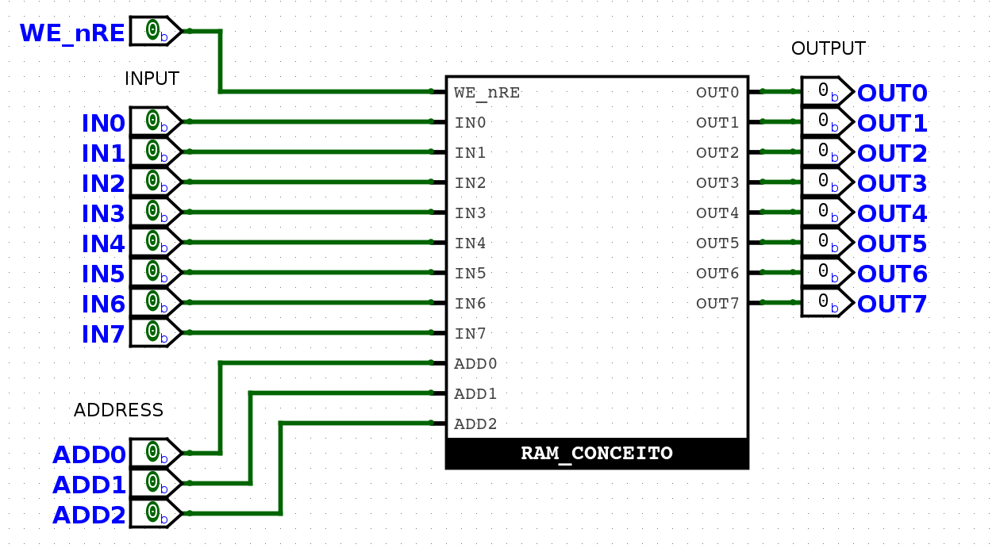
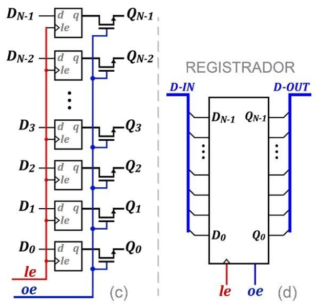
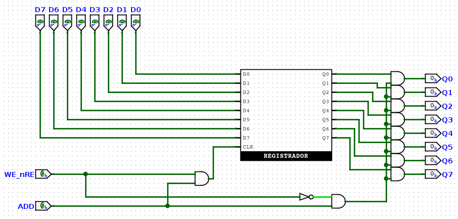
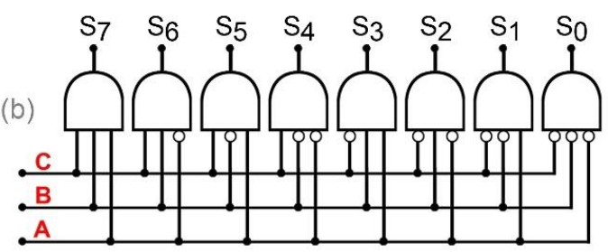
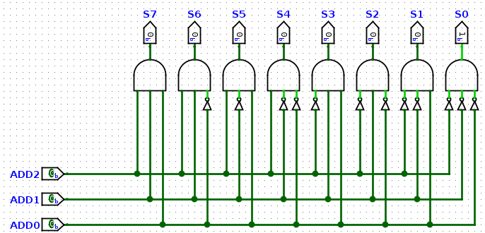
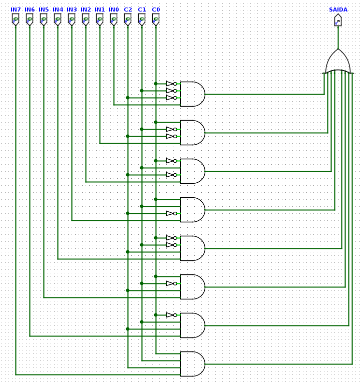
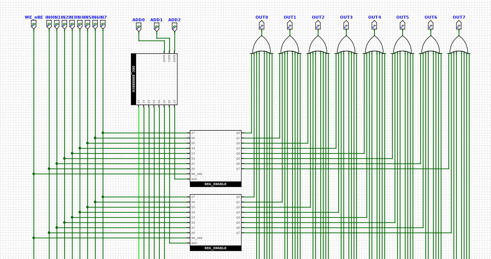
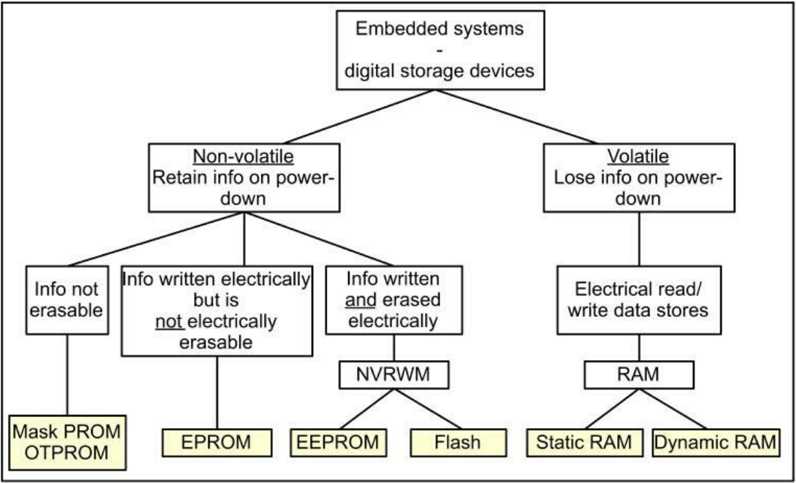
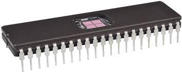

# Memórias
### Prof. João Paulo Cerquinho Cajueiro
#### Baseado em slides de Prof. José Rodrigues de Oliveira Neto

Universidade Federal de Pernambuco  
Departamento de Engenharia Mecânica

---

## Introdução

Os sistemas microcontrolados trabalham:
* a partir de um código que é salvo em uma **memória de programa**,
* com variáveis internas ao núcleo de processamento armazenadas em um **banco de registradores** ,
* com os dados lidos e gerados pelos programas salvos em uma **memória de dados**. 

Todos estes são tipos de memórias, de acordo com sua aplicação.

  

  <small>Fonte - (GARCIA, 2018).</small>

---

## Memórias RAM e ROM

* Registradores - voláteis, implementados com flip-flops.
* RAM (*Random Access Memory*) - memórias voláteis, mantidas enquanto o sistema funciona.
* ROM (*Read-Only Memory*) - memórias apenas de leitura, não-voléteis, que mantém a informação mesmo sem energia.

  
  <small>Fonte - (GARCIA, 2018).</small>

---

## Memória RAM como caixa preta

  

* Entradas:
    * **Dados de Entrada** - $n$ bits.
    * **Sinais de Controle** - endereço, comando, clock.
* Saídas:
    * **Dados de Saída.** - $n$ bits.

---

## Exemplo

* Memória que guarda 8 palavras de 8 bits, logo:
    * **Dados de Entrada:** 8 bits {`IN0`, `IN1`, $\cdots$, `IN7`}
    * **Sinais de Controle:**
        * Endereço da palavra: 3 bits {`ADD0` , `ADD1`, `ADD2`}.
        * Escrever ou Ler: 1 bit {$\mathsf{WE/\overline{RE}}$}.
    * **Dados de Saída:** 8 bits {`OUT0`, `OUT1`, $\cdots$, `OUT7`}

  

---

* Internamente, cada uma dessas palavras de 8 bits será guardada em um registrador implementado com Flip-Flops tipo D.
* Em que **`le`** habilita a escrita no registrador e **`oe`** habilita a leitura no registrador.

  
  <small>Fonte - (RANHEL, 2021).</small>

---

* Na nossa implementação nós já adicionamos o fato que só habilitaremos a leitura ou a escrita em um dado instante ($\mathsf{WE/\overline{RE}}$). 
* Além do fato de que como teremos vários registradores ligados ao mesmo barramento de entrada, que apenas quando o endereço de um registrador específico for selecionado é que a escrita ou leitura estará habilitada (`ADD`).

  
  <small>Fonte - Produzido pelo autor.</small>

---

* Logo necessitaremos de um circuito que decodifique o nosso endereço `ADD[0:2]` para habilitar apenas um dos 8 registradores `S[0:7]`

  
  <small>Fonte - (RANHEL, 2021).</small>

---

* Logo necessitaremos de um circuito que decodifique o nosso endereço `ADD[0:2]` para habilitar apenas um dos 8 registradores `S[0:7]`

  
  <small>Fonte - Produzido pelo autor.</small>

---

* Poderíamos ainda ter cada bit de cada um dos registradores indo para um circuito multiplexador onde apenas uma das 8 entradas (`IN[0:7]`) estaria habilitada a parir de um sinal de controle (`C[0:2]`): 

  
  <small>Fonte - Produzido pelo autor.</small>

---

* No entanto, parte do multiplexador já tinha sido implementada pelo decodificado: 

  
  <small>Fonte - Produzido pelo autor.</small>

---

## Guardando Informação em Sistemas Embarcados

* Várias tecnologias e dispositivos tem sido desenvolvidos para armazenar informação em sistemas embarcados. 
* Podemos agrupá-los em dois grandes grupos:
    * **Armazenamento volátil;**
    * **Armazenamento não-volátil.**

--

  
  <small>Fonte - (COOLING, 2018).</small>

---

### Armazenamento Não-Volátil de Dados

* Existem três categorias de armazenamento não-volátil, dependendo de como a informação pode ser reprogramada:
    * **Armazenamento não apagável;** 
    * **Armazenamento apagável por UV;**
    * **Memória de escrita e leitura não-volátil**;

---

* Existem dois tipos de memórias não apagáveis:
    * **mask PROM:** *mask programmable ready-only memory* - são programadas durante a manufatura, são as mais baratas.
    * **OTPROM:** *one-time programmable read-only memory* - são vendidas no estado **apagado** e então são programadas uma única vez eletricamente. 

---

* Chamadas de EPROM: *UV-erasable electrically programmable read-only memory*; nessas memórias o conteúdo pode ser apagado com luz ultravioleta.

  
  <small>Fonte - https://www.reichelt.com/de/en/c-mos-uv-eprom-c-dil-42-2mx8-1mx16-100-ns-27c160-100-p40037.html.</small>

---

* Existem dois principais tipos de memórias não-voláteis de escrita e leitura:
    * **EEPROM:** *elctrically erasable programmable read-only memory*;
    * **Fash momory:** muito utilizadas em *single-chip mocrocontrollers*;
* Existem outros tipos menos utilizados, como as FRAM (*ferro-electric rando access memory*) e as MRAM (*magnetoresistive RAM*).

---

### Armazenamento Volátil de Dados

* Em geral, os dispositivos de armazenamento de dados voláteis são chamados de RAM (*random access memories*), mesmo que isso não seja verdade sempre.
* Podem vir em duas formas:
    * **SRAM:** *static RAM*;
    * **DRAM:** *dynamic RAM*.
* Não focaremos em como elas trabalham e sim em:
    * custo;
    * velocidade;
    * densidade de bits;
    * consumo de energia;
    * confiabilidade.

---

### Dispositivos de Memória - Flash-RAM

* Considerando apenas os tipos de memórias mais utilizadas: Flash, SRAM e DRAM. 
* A primeira vista, seria possível dizer que a memória Flash seria suficiente para todas as necessidades de um sistemas embarcado.
* No entanto, existem duas coisas que impactam muito o uso dela como única forma de armazenamento de dados:
    * Velocidade;
    * Desgaste;

--

* Quanto a **velocidade**, a leitura de dados da memória Flash é rápida, tão rápida quanto as SRAM de propósito geral.
* No entanto, a escrita é cerca de 10 vezes mais lenta. 
* A diferença se dá pois para escrever um novo dado na Flash é preciso primeiro apagá-la antes de escrever um novo dado. 
* Se a maior parte das operações na memória forem de leitura, a performance da Flash é comparável com uma RAM. 

--

* Quanto a **vida útil**, o processo de apagar e escrever na memória Flash causa um desgaste no chip.
* Com isso, a vida útil das memórias Flash é menor que as memórias RAM.
* O mesmo problema ocorre com as memórias EEPROM.
* Com o avanço da tecnologia, o número de ciclos de escrita e leitura das memórias Flash vem aumentando, tanto que são cada vez mais utilizadas no lugar de HDs em computadores pessoais.

---

## Novas tecnologias

--

| Característica | SRAM | DRAM | MRAM (STT-MRAM) | FRAM (FeRAM) | ReRAM (RRAM) | Flash NOR/NAND |
|---|---|---|---|---|---|---|
| **Volatilidade** | Volátil | Volátil | Não-volátil | Não-volátil | Não-volátil | Não-volátil |
| **Velocidade de Leitura** | 1-10 ns | 10-20 ns | 35 ns | 60 ns | 20-50 ns (standalone) até 50 μs | 50-100 ns (NOR) / μs (NAND) |
| **Velocidade de Escrita** | 1-10 ns | 10-20 ns | 35 ns | ~1 ns (movimento atômico), ciclo 115 ns | 20-30 μs (típico), até 10 ns (demonstrado) | ms (muito lento) |
| **Vida Útil (Endurance)** | Ilimitado | Ilimitado | 10¹⁰ ciclos (praticamente ilimitado) | 10¹⁰ a 10¹⁵ ciclos | 10⁴ a 10⁷ ciclos | 10⁴ a 10⁵ ciclos |
| **Retenção de Dados** | Enquanto energizado | Milissegundos | 20 anos | Décadas | 10 anos a 105°C | 10 anos |

--

| Característica | SRAM | DRAM | MRAM (STT-MRAM) | FRAM (FeRAM) | ReRAM (RRAM) | Flash NOR/NAND |
|---|---|---|---|---|---|---|
| **Densidade** | Baixa (6 transistores/célula) | Alta (1 transistor + 1 capacitor) | Média-Alta (1 transistor + 1 MTJ) | Limitada a ~4 Mb | Alta densidade possível | Muito alta |
| **Consumo de Energia** | Alto | Médio | Muito baixo | Muito baixo (~1 fJ por bit) | Baixo (5 fJ demonstrado) | Alto (especialmente escrita) |
| **Custo por GB (2024)** | US$ 100-200 | US$ 4-5 | US$ 6-8 (55% acima de DRAM) | US$ 5-7 | US$ 3-5 | US$ 0,30-0,50 (NAND) |

--

### Comparação de Preços por Gigabit (2024-2025)

| Tecnologia | Custo Aproximado/GB | Posicionamento de Mercado |
|---|---|---|
| **Flash NAND** | US$ 0,30-0,50 | Referência de custo mais baixo |
| **ReRAM** | US$ 3-5 | Competitivo com DRAM |
| **DRAM** | US$ 4-5 | Padrão memória volátil |
| **FRAM** | US$ 5-7 | Similar ou acima de DRAM |
| **MRAM** | US$ 6-8 | Premium: 55% acima de DRAM |
| **SRAM** | US$ 100-200 | Premium extremo (cache) |

--

## Equivalência com Memórias Tradicionais

| Tecnologia | Velocidade | Volatilidade | Densidade | Consumo | Aplicação Principal |
|---|---|---|---|---|---|
| **SRAM** | Muito rápida (1-10ns) | Volátil | Muito baixa | Alto (estático) | Cache L1/L2/L3 |
| **DRAM** | Rápida (10-20ns) | Volátil (refresh) | Alta | Médio (refresh) | Memória RAM principal |
| **MRAM** | ~SRAM (35ns) | Não-volátil | Média | Muito baixo | "SRAM não-volátil" |
| **FRAM** | Entre SRAM e DRAM | Não-volátil | Limitada | Muito baixo | "DRAM não-volátil rápida" |
| **ReRAM** | Entre DRAM e Flash | Não-volátil | Alta | Baixo | "Flash rápido" |
| **Flash** | Lento (μs-ms) | Não-volátil | Muito alta | Alto (escrita) | Armazenamento em massa |
