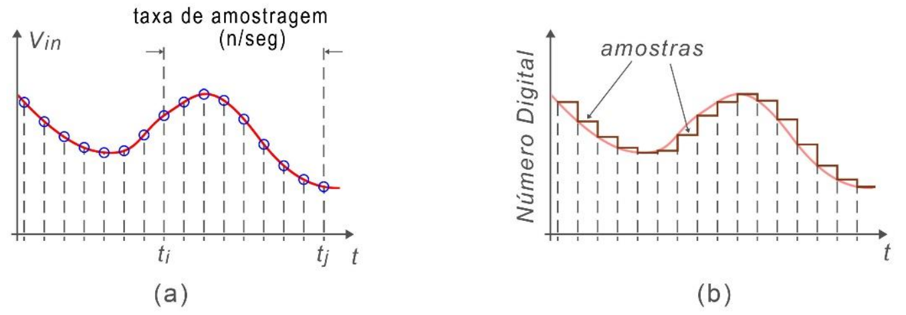
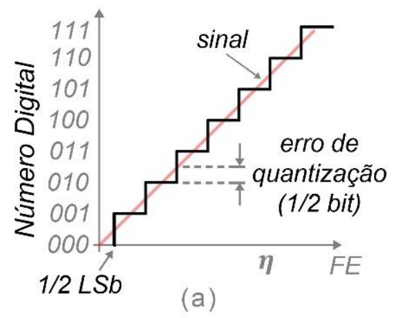

# Conversão e Quantização

---

## Introdução

* **Tempo Discreto:** a conversão de sinais para valores digitais implicitamente transforma o sinal em ``**amostras**'' discretas (processo de **amostragem**).
* **Quantização:** Atribuir valores discretos para um sinal contínuo (real). 
* **Erro de Quantização:** diferença entre o valor quantizado e o contínuo. 

---

## Amostragem

* Amostragem (*sampling*) é o processo de redução de um valor contínuo no tempo para valores tomados em tempo discretos, geralmente em intervalos constantes. 

<small>Fonte - (RANHEL, 2021).</small>

--

* O sinal amostrado se torna uma série de valores numéricos discretos, separados em intervalos de tempo predefinidos. 

<small>Fonte - (RANHEL, 2021).</small>

--

* Denomina-se **taxa de amostragem** (*sample rate*) a quantidade de amostras tomadas do sinal contínuo por segundo. 

<small>Fonte - (RANHEL, 2021).</small>

--

* O número mínimo de amostras por segundo para que um sinal seja recomposto livre de distorção é chamado de taxa de Nyquist, que descreve que uma frequência de amostragem deve ser pelo menos duas vezes maior que a maior frequência do sinal contínuo. 
* O sinal contínuo original *poderia* ser reconstituído a partir da sequência de amostras, reconvertidas para valores de tensão ou corrente na mesma velocidade que foram capturadas. 

---

## Resolução dos Conversores

* A resolução de um ADC (*analog to digital converter*) é tão maior quando mais bits ele utiliza para guardar suas amostras.
* Um ADC de $N$ bits consegue reproduzir $2^N$ valores diferentes, representando então $2^N$ valores de amplitude de entrada diferentes. 

--

* A maioria dos conversores ADC usa dois sinais para estabelecer os limites do intervalo de tensão a ser convertida: 
    1. $V_{RefL}$ - **referência baixa** $\rightarrow$ valor mínimo: 0;
    2. $V_{RefH}$ = **referência alta** $\rightarrow$ valor máximo: $2^N$.

* A tensão de fundo de escala (*full scale voltage range*) é dada por:

  $E_{FSR} = V_{RefH} - V_{RefL}.$

* É usual que se ligue a referência $V_{RefL}$ ao *GND*, tornando a tensão $V_{RefH}$ igual à tensão máxima de conversão. 

--

* chamamos de **resolução** do conversor o número de bits usados para digitalizar amostras de uma sinal contínuo. 
* A resolução, em termos de incremento de tensão $\delta_v$, do ADC é igual ao degrau de tensão causado pelo bit menos significativo, LSB (*least significant bit*), dado por:

  $\delta_V =  \frac{E_{FSR}}{2^N}.$

* Usamos a grandeza **tensão** porque é mais usual termos conversores de tensão, uma vez que a conversão de correntes elétricas geralmente é feita pela transdução de corrente em tensão. 

---

## Quantização e Erro de Quantização

* Processo de mapear valores de um sinal contínuo, ou de uma sequência numérica infinita, em valores discretos, resultando um conjunto menor com número finito de elementos.
* Um ADC é um **quantizador**.
* Quantizadores se baseiam em limiares durante o processo de conversão do sinal, gerando arredondamentos ou truncamentos de valores. 

--

* A diferença entre um valor contínuo de entrada e seu valor quantizado, com arredondamentos e/ou truncamentos, é conhecida como **erro de quantização**.
* Arredondar um número real $x$ para um valor inteiro mais próximo forma um tipo básico de quantizador. 
* Um quantizador **uniforme** com um passo de incremento de $\Delta$ pode ser expresso por:

  $Q(x) =  \Delta \times \left\lfloor \frac{x}{\Delta} +  \frac{1}{2}\right\rfloor,$

em que, $\lfloor \cdot \rfloor$ é a função *floor*, $Q(x)$ é a quantidade obtida e $\Delta$ é o passo de quantização; ou seja, em certo sentido pode ser visto como a resolução do quantificador. 

--

* No contexto de ADC chamamos de $\delta_V$ o nível mínimo de tensão que o bit LSB do quantizador representa.
* Para minimizar o erro de quantização a melhor tática é usar como **limiar** metade do valor LSB para comparar com o sinal de entrada.
* Em um ADC ideal, o erro de quantização é distribuído entre $-1/2\textnormal{LSB}$ e $+1/2\textnormal{LSB}$ de maneira uniforme, cobrindo todos os níveis de quantização. 

<small>Fonte - (RANHEL, 2021).</small>

--

* O erro de quantização introduz ruído ao sinal amostrado, chamado de **ruído de quantização.**
* Como o erro de quantização está ligado à resolução do quantizador, quanto maior resolução do ADC menor será o erro e o ruído. 
* A relação entre a resolução (em bits) e o ruído de quantização para um ADC ideal pode ser expressa em termos da relação sinal/ruído (*signal-to-quantization-noise ratio*), expressa em decibéis ($dB$):

  $$SQNR_{dB} =  20.\log_{10}(2^N) \approx (6,02N)dB, $$

em que, $N$ é a resolução do ADC em bits. 

* Valores típicos de $SQNR_{dB}$ para conversores ideais são $96 dB$ para ADCs de 16 bits, $72 dB$ para ADCs de 12 bits e $48 dB$ para ADCs de 8 bits.

---

## Considerações na Escolha do Conversor

* Muitas vezes o projetista se depara com um desafio de escolha de um DAC (*digital to analog converter*) e ADC.
* Vamos enumerar a seguir requisitos que o projetista deve levar em conta quanto se depara com esse dilema. 

---

### Parâmetros Gerais dos Conversores

1. **Resolução do ADC/DAC:** quantos bits o conversor precisa ter?
2. **Taxa de amostragem (*sample rate*):** qual é a frequência do sinal que se deseja amostrar?
3. **Velocidade:** qual o tempo mínimo para uma conversão? 
4. **Tipo de sinal:** o sinal tem valores positivos e negativos?
5. **Precisão:** quão preciso, linear, ajustável é o conversor? 

---

### Requisitos de um DAC

1. **Entrada:** serial, paralela, tem registrador? Tem isolamento óptico? 
2. **Saída:** quais limites de tensão e corrente da saída? 
3. **Referências:** qual a referência do sinal de saída?
4. **Filtros:** o circuito exige filtros de saída?
5. **Adequações:** a saída deve ser amplificada? Qual o nível de corrente de saída exigida?

---

### Requisitos de um ADC

1. **Entrada:** como é a entrada do valor analógico? 
2. **Saída:** como é a interface digital do sistema? Serial ou Paralela?
3. **Referências:** quem será $V_{RefL}$ e $V_{RefH}$? A referência $V_{RefL}$ pode ser *GND*? Qual a tensão máxima que o conversor pode receber? 

---

## Bibliografia

* RANHEL, João. ``**Eletrônica Digital, Verilog e FPGA**'', 1$^a$ ed., Clube do Autor, 2021.
* Tutorial Logisim: http://www.cburch.com/logisim/docs/2.7/pt/html/guide/index.html

